# Intrusive Memory — Package Dependency Graph

Visual dependency map for the Intrusive Memory Swift Package Collection.
Derived from `collection.json` (revision 17, generated 2026-04-21).

Low-level foundational libraries are at the top. Data flows downward toward
the two ultimate destination apps — **Produciesta** (screenplay → audio
pipeline) and **SwiftVinetas** (image generation orchestration).

> **Action required:** edges and nodes marked red have outstanding issues
> tracked in [REQUIREMENTS.md](REQUIREMENTS.md). Every red item in this
> document maps to a specific requirement section.

---

## Legend

| Style | Meaning |
|---|---|
| 🟢 Green node | All dependencies resolve cleanly against shipped releases |
| 🔴 Red node | Has one or more unresolved dependency issues — see fix table below |
| 🔵 Blue node (hex shape) | **Inferred** consumer app — not curated in `collection.json`; incoming edges are inferred from package role and have **not** been verified against the app's actual `Package.swift` |
| ⚪ Grey dashed node | External / not tracked in the collection |
| Solid edge | Verified dependency from `collection.json` |
| **Red solid edge** | Dependency needs fixing (branch pin, missing version, or untracked sibling) |
| Blue dashed edge | Inferred consumer relationship — unverified |

---

## Dependency Graph

```mermaid
graph TD
    %% ============ Level 0: Foundational ============
    SwiftAcervo[SwiftAcervo<br/>v0.7.2]
    SwiftFijos[SwiftFijos<br/>v1.4.1]
    SwiftOnce[SwiftOnce<br/>v0.2.0]
    SwiftFFMpeg[SwiftFFMpeg<br/>v8.0.2]
    VoxFormat[vox-format<br/>v0.3.1]

    %% ============ Level 1 ============
    SwiftBruja[SwiftBruja<br/>v1.5.1]
    SwiftCompartido[SwiftCompartido<br/>v7.0.2]
    MLXAudioSwift[mlx-audio-swift<br/>v0.4.0]
    SwiftTuberia[SwiftTuberia<br/>v0.4.0]

    %% ============ Level 2 ============
    SwiftProyecto[SwiftProyecto<br/>v3.4.0]
    SwiftSecuencia[SwiftSecuencia<br/>v3.2.1]

    %% ============ Level 3 ============
    SwiftHablare[SwiftHablare<br/>v5.7.2]

    %% ============ Level 4 ============
    SwiftVoxAlta[SwiftVoxAlta<br/>v0.9.8]

    %% ============ Level 5 ============
    SwiftEchada[SwiftEchada<br/>v0.10.3]

    %% ============ Consumer apps (inferred) ============
    Produciesta{{Produciesta}}
    SwiftVinetas{{SwiftVinetas}}

    %% ============ External / untracked ============
    PipelineNeo[/pipeline-neo<br/>UNTRACKED/]

    %% ============ Edges — intra-org (indices 0..21) ============
    SwiftAcervo --> SwiftBruja
    SwiftAcervo --> MLXAudioSwift
    SwiftAcervo --> SwiftTuberia
    SwiftFijos -->|branch:main| SwiftCompartido
    SwiftBruja --> SwiftProyecto
    SwiftAcervo --> SwiftProyecto
    SwiftCompartido -->|branch:main| SwiftSecuencia
    SwiftFijos -->|branch:main| SwiftSecuencia
    PipelineNeo -->|branch:dev - untracked| SwiftSecuencia
    SwiftFijos -->|branch:main| SwiftHablare
    SwiftCompartido -->|branch:main| SwiftHablare
    SwiftProyecto -->|branch:main| SwiftHablare
    SwiftOnce -->|branch:main| SwiftHablare
    SwiftHablare -->|pins 5.7.5 - latest 5.7.2| SwiftVoxAlta
    MLXAudioSwift --> SwiftVoxAlta
    SwiftAcervo --> SwiftVoxAlta
    SwiftTuberia --> SwiftVoxAlta
    VoxFormat --> SwiftVoxAlta
    SwiftProyecto -->|branch:main| SwiftEchada
    SwiftVoxAlta -->|branch:main| SwiftEchada
    MLXAudioSwift -->|branch:main| SwiftEchada
    VoxFormat -->|branch:main| SwiftEchada

    %% ============ Edges — inferred app consumers (indices 22..30) ============
    SwiftCompartido -.->|inferred| Produciesta
    SwiftHablare -.->|inferred| Produciesta
    SwiftVoxAlta -.->|inferred| Produciesta
    SwiftSecuencia -.->|inferred| Produciesta
    SwiftProyecto -.->|inferred| Produciesta
    SwiftFFMpeg -.->|inferred| Produciesta
    SwiftEchada -.->|inferred| Produciesta
    SwiftTuberia -.->|inferred| SwiftVinetas
    SwiftAcervo -.->|inferred| SwiftVinetas

    %% ============ Node styling ============
    classDef healthy fill:#d4f4dd,stroke:#2d7d46,color:#000
    classDef broken fill:#ffcccc,stroke:#cc0000,stroke-width:2px,color:#000
    classDef app fill:#cce5ff,stroke:#0066cc,stroke-width:2px,color:#000
    classDef external fill:#f5f5f5,stroke:#999999,stroke-dasharray:3 3,color:#666

    class SwiftAcervo,SwiftFijos,SwiftOnce,SwiftFFMpeg,VoxFormat,SwiftBruja,MLXAudioSwift,SwiftTuberia,SwiftProyecto healthy
    class SwiftCompartido,SwiftSecuencia,SwiftHablare,SwiftVoxAlta,SwiftEchada broken
    class Produciesta,SwiftVinetas app
    class PipelineNeo external

    %% ============ Edge styling — red for broken intra-org edges ============
    linkStyle 3 stroke:#cc0000,stroke-width:2px
    linkStyle 6 stroke:#cc0000,stroke-width:2px
    linkStyle 7 stroke:#cc0000,stroke-width:2px
    linkStyle 8 stroke:#cc0000,stroke-width:2px
    linkStyle 9 stroke:#cc0000,stroke-width:2px
    linkStyle 10 stroke:#cc0000,stroke-width:2px
    linkStyle 11 stroke:#cc0000,stroke-width:2px
    linkStyle 12 stroke:#cc0000,stroke-width:2px
    linkStyle 13 stroke:#cc0000,stroke-width:2px
    linkStyle 18 stroke:#cc0000,stroke-width:2px
    linkStyle 19 stroke:#cc0000,stroke-width:2px
    linkStyle 20 stroke:#cc0000,stroke-width:2px
    linkStyle 21 stroke:#cc0000,stroke-width:2px

    %% ============ Edge styling — inferred app edges (dashed blue) ============
    linkStyle 22 stroke:#5588cc,stroke-dasharray:5 5
    linkStyle 23 stroke:#5588cc,stroke-dasharray:5 5
    linkStyle 24 stroke:#5588cc,stroke-dasharray:5 5
    linkStyle 25 stroke:#5588cc,stroke-dasharray:5 5
    linkStyle 26 stroke:#5588cc,stroke-dasharray:5 5
    linkStyle 27 stroke:#5588cc,stroke-dasharray:5 5
    linkStyle 28 stroke:#5588cc,stroke-dasharray:5 5
    linkStyle 29 stroke:#5588cc,stroke-dasharray:5 5
    linkStyle 30 stroke:#5588cc,stroke-dasharray:5 5
```

---

## Red items → REQUIREMENTS.md mapping

Every red edge and red node in the graph above is tracked as an actionable
requirement. The table below maps each visual flag to its fix item.

### Red nodes (packages needing fixes)

| Package | Reason | Fix tracked in |
|---|---|---|
| 🔴 SwiftCompartido | Branch-pins `SwiftFijos` | [REQUIREMENTS.md §1](REQUIREMENTS.md#1-branch-pinned-internal-dependencies) |
| 🔴 SwiftSecuencia | Branch-pins `SwiftCompartido` + `SwiftFijos`; depends on untracked `pipeline-neo` | [REQUIREMENTS.md §1](REQUIREMENTS.md#1-branch-pinned-internal-dependencies), [§4](REQUIREMENTS.md#4-untracked-intrusive-memory-siblings-referenced-as-deps) |
| 🔴 SwiftHablare | Branch-pins four siblings (`SwiftFijos`, `SwiftCompartido`, `SwiftProyecto`, `SwiftOnce`) | [REQUIREMENTS.md §1](REQUIREMENTS.md#1-branch-pinned-internal-dependencies) |
| 🔴 SwiftVoxAlta | Pins `SwiftHablare upToNextMajor: 5.7.5` but 5.7.5 has not shipped (latest 5.7.2) | [REQUIREMENTS.md §2](REQUIREMENTS.md#2-version-mismatches-against-shipped-releases) |
| 🔴 SwiftEchada | Branch-pins four siblings + upstream `mlx-swift-lm` on `branch: main` | [REQUIREMENTS.md §1](REQUIREMENTS.md#1-branch-pinned-internal-dependencies), [§3](REQUIREMENTS.md#3-mlx-swift-lm-3313-migration-in-flight) |

### Red edges (dependency specs needing fixes)

| # | From → To | Current spec | Fix | Tracked in |
|---|---|---|---|---|
| 1 | SwiftFijos → SwiftCompartido | `branch: main` | Pin to `from: 1.4.1` | [§1](REQUIREMENTS.md#1-branch-pinned-internal-dependencies) |
| 2 | SwiftCompartido → SwiftSecuencia | `branch: main` | Pin to `from: 7.0.2` | [§1](REQUIREMENTS.md#1-branch-pinned-internal-dependencies) |
| 3 | SwiftFijos → SwiftSecuencia | `branch: main` | Pin to `from: 1.4.1` | [§1](REQUIREMENTS.md#1-branch-pinned-internal-dependencies) |
| 4 | pipeline-neo → SwiftSecuencia | `branch: development` | Publish release + add to collection | [§1](REQUIREMENTS.md#1-branch-pinned-internal-dependencies), [§4](REQUIREMENTS.md#4-untracked-intrusive-memory-siblings-referenced-as-deps) |
| 5 | SwiftFijos → SwiftHablare | `branch: main` | Pin to `from: 1.4.1` | [§1](REQUIREMENTS.md#1-branch-pinned-internal-dependencies) |
| 6 | SwiftCompartido → SwiftHablare | `branch: main` | Pin to `from: 7.0.2` | [§1](REQUIREMENTS.md#1-branch-pinned-internal-dependencies) |
| 7 | SwiftProyecto → SwiftHablare | `branch: main` | Pin to `from: 3.4.0` | [§1](REQUIREMENTS.md#1-branch-pinned-internal-dependencies) |
| 8 | SwiftOnce → SwiftHablare | `branch: main` | Pin to `from: 0.2.0` | [§1](REQUIREMENTS.md#1-branch-pinned-internal-dependencies) |
| 9 | SwiftHablare → SwiftVoxAlta | `upToNextMajor: 5.7.5` (doesn't exist) | Ship Hablare 5.7.5 **or** loosen to `5.7.2` | [§2](REQUIREMENTS.md#2-version-mismatches-against-shipped-releases) |
| 10 | SwiftProyecto → SwiftEchada | `branch: main` | Pin to `from: 3.4.0` | [§1](REQUIREMENTS.md#1-branch-pinned-internal-dependencies) |
| 11 | SwiftVoxAlta → SwiftEchada | `branch: main` | Pin to `from: 0.9.8` (after §2 resolved) | [§1](REQUIREMENTS.md#1-branch-pinned-internal-dependencies) |
| 12 | mlx-audio-swift → SwiftEchada | `branch: main` | Pin to `from: 0.4.0` | [§1](REQUIREMENTS.md#1-branch-pinned-internal-dependencies) |
| 13 | vox-format → SwiftEchada | `branch: main` | Pin to `from: 0.3.1` | [§1](REQUIREMENTS.md#1-branch-pinned-internal-dependencies) |

Additional upstream pin (not graphed — external repo):

| From → To | Current spec | Fix | Tracked in |
|---|---|---|---|
| ml-explore/mlx-swift-lm → SwiftEchada | `branch: main` | Pin to `upToNextMajor: 3.31.3` | [§3](REQUIREMENTS.md#3-mlx-swift-lm-3313-migration-in-flight) |

---

## Inferred edges — caveat

The nine blue dashed edges feeding **Produciesta** and **SwiftVinetas** are
**inferred from each library's stated purpose**, not read from those apps'
`Package.swift` files. They show the *intended* ecosystem shape but have
not been verified.

If accuracy matters for these two nodes, either:
1. Add Produciesta and SwiftVinetas to `collection.json` so their deps are
   tracked the same way library deps are, or
2. Manually audit each app's `Package.swift` and update this graph.

---

## Healthy packages

These nine packages have all dependencies resolving against shipped,
semver-pinned releases with no outstanding issues:

- `SwiftAcervo` (v0.7.2)
- `SwiftFijos` (v1.4.1)
- `SwiftOnce` (v0.2.0)
- `SwiftFFMpeg` (v8.0.2)
- `vox-format` (v0.3.1)
- `SwiftBruja` (v1.5.1)
- `mlx-audio-swift` (v0.4.0)
- `SwiftTuberia` (v0.4.0)
- `SwiftProyecto` (v3.4.0)

---

## Regenerating this document

This file is hand-maintained based on `collection.json`. When the collection
is refreshed via `/update-package-library`, re-audit:

1. Each package's `dependencies` block in `collection.json` for new branch
   pins or version mismatches.
2. REQUIREMENTS.md for resolved items — move packages from 🔴 back to 🟢
   when their fixes land.
3. Edge indices in the Mermaid `linkStyle` block if edges are added/removed.
