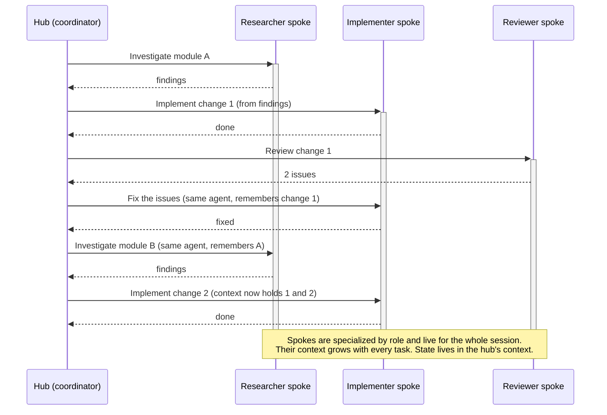
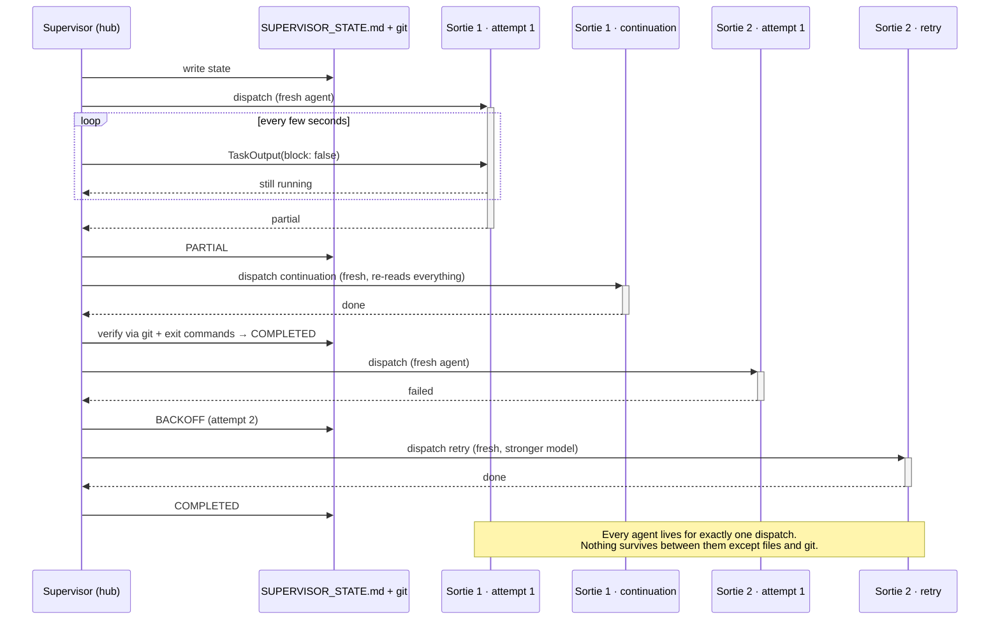
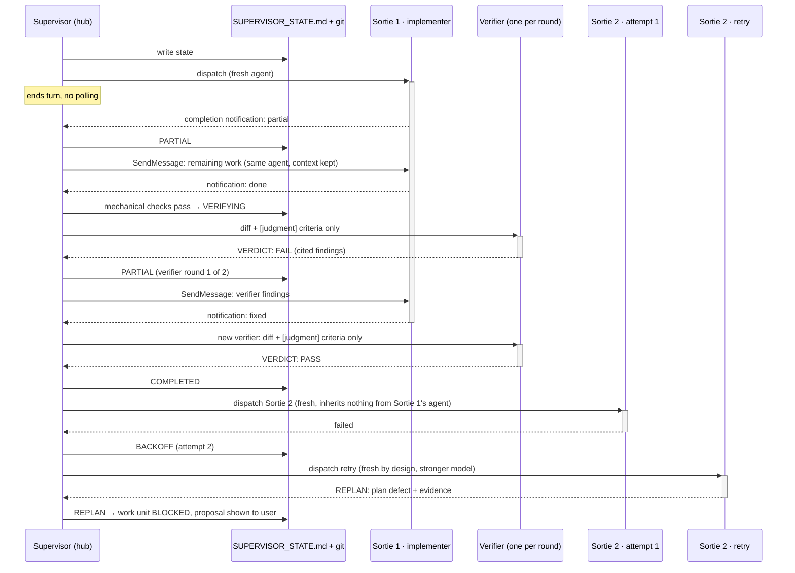

# Mission Supervisor

Orchestrate multi-agent sortie execution with automatic verification, retry logic, and state management.

## Overview

The Mission Supervisor is an agentic orchestrator that breaks down complex projects into atomic sorties and dispatches background agents to execute them in parallel. It manages state, handles failures with automatic retry, and enforces dependency constraints.

**Key Features**:
- **Pre-execution pipeline**: Break down requirements, refine execution plans with 4 automated passes
- **Parallel execution**: Run independent work units simultaneously (up to 4 sub-agents)
- **Automatic verification**: Validate sortie completion via git state, exit criteria, and agent output
- **Fault tolerance**: Automatic retry with backoff, graceful degradation
- **State persistence**: Crash-safe state management across invocations
- **The Ritual**: Humorous military operation names generated at execution start

> **Terminology**: A *mission* is the definable scope of work. A *sortie* is an atomic agent task within that mission. The Mission Supervisor orchestrates the mission by dispatching sorties. See skill.md for full definitions.

---

## Recommended Workflow

The recommended path is **breakdown** then **refine** then restart the context window with **start**.

```
┌─────────────────────────────────────────────────────────────┐
│                    REQUIREMENTS DOCUMENT                     │
│                  (PRD, SPEC, README, etc.)                   │
└───────────────────────────┬─────────────────────────────────┘
                            │
                            ▼
                  ┌─────────────────────┐
                  │  /mission-supervisor │
                  │      breakdown      │
                  └──────────┬──────────┘
                             │
                             │ Generates
                             ▼
┌─────────────────────────────────────────────────────────────┐
│                      EXECUTION_PLAN.md                       │
│  • Work units (packages/components/phases)                   │
│  • Sorties (3-7 atomic tasks each)                          │
│  • Dependencies (layers, prerequisites)                      │
│  • Entry/Exit criteria (machine-verifiable)                 │
└───────────────────────────┬─────────────────────────────────┘
                            │
                            ▼
                  ┌─────────────────────┐
                  │  /mission-supervisor │
                  │       refine        │
                  └──────────┬──────────┘
                             │
                             │ Runs 4 passes sequentially
                             ▼
        ┌───────────────────────────────────┐
        │                                   │
        │  Pass 1: Atomicity & Testability  │
        │  (refine-atomicity)               │
        │  • Context fitness check          │
        │  • Sortie sizing (split/merge)    │
        │  • Machine-verifiable criteria    │
        │                                   │
        └───────────────┬───────────────────┘
                        │
                        ▼
        ┌───────────────────────────────────┐
        │                                   │
        │  Pass 2: Prioritization           │
        │  (refine-priority)                │
        │  • Dependency depth scoring       │
        │  • Foundation/risk/complexity     │
        │  • Priority-based reordering      │
        │                                   │
        └───────────────┬───────────────────┘
                        │
                        ▼
        ┌───────────────────────────────────┐
        │                                   │
        │  Pass 3: Parallelism              │
        │  (refine-parallelism)             │
        │  • Dependency graph analysis      │
        │  • Agent allocation (up to 4)     │
        │  • Builds: supervising agent only │
        │  • Critical path identification   │
        │                                   │
        └───────────────┬───────────────────┘
                        │
                        ▼
        ┌───────────────────────────────────┐
        │                                   │
        │  Pass 4: Open Questions           │
        │  (refine-questions)               │
        │  • TBD/TODO marker detection      │
        │  • Vague criteria replacement     │
        │  • Missing documentation flags    │
        │  • External dependency checks     │
        │                                   │
        └───────────────┬───────────────────┘
                        │
                        ▼
┌─────────────────────────────────────────────────────────────┐
│              EXECUTION_PLAN.md (refined)                     │
│  • Atomic sorties (right-sized for context budget)          │
│  • Machine-verifiable exit criteria                         │
│  • Optimal execution order (priority-based)                 │
│  • Parallelism annotations (agent allocation)               │
│  • Open questions resolved or flagged                       │
└───────────────────────┬─────────────────────────────────────┘
                        │
                        │ ✦ RESTART CONTEXT WINDOW ✦
                        │ (fresh context for execution)
                        │
                        ▼
              ┌─────────────────────┐
              │  /mission-supervisor │
              │        start        │
              └──────────┬──────────┘
                         │
                         │ 1. THE RITUAL (name-feature)
                         │    Generates operation name
                         │ 2. Initializes state
                         ▼
┌─────────────────────────────────────────────────────────────┐
│                   SUPERVISOR_STATE.md                        │
│  • Work unit states (NOT_STARTED → RUNNING → COMPLETED)    │
│  • Sortie states (PENDING → DISPATCHED → RUNNING)          │
│  • Active agents table (task IDs, output files)            │
│  • Attempt counters (for retry logic)                      │
└───────────────────────┬─────────────────────────────────────┘
                        │
                        │ Event Loop
                        ▼
        ┌───────────────────────────────────┐
        │                                   │
        │  1. Dispatch background agents    │
        │     (parallel for independent     │
        │      work units)                  │
        │                                   │
        │  2. Wait for completion           │
        │     (notifications — no polling)  │
        │                                   │
        │  3. Verify sortie outcome         │
        │     • Git commits                 │
        │     • Exit criteria commands      │
        │     • Agent output signals        │
        │     • [judgment] → verifier       │
        │                                   │
        │  4. Handle results                │
        │     • SUCCESS → next sortie       │
        │     • PARTIAL → same agent        │
        │     • FAILURE → fresh retry       │
        │     • FATAL → BLOCKED (manual)    │
        │     • REPLAN → BLOCKED (plan fix) │
        │                                   │
        │  5. Update state                  │
        │     (SUPERVISOR_STATE.md)         │
        │                                   │
        │  6. Check dependency gates        │
        │     (unlock new work units)       │
        │                                   │
        └───────────────┬───────────────────┘
                        │
                        │ Repeat until
                        ▼
        ┌───────────────────────────────────┐
        │   All work units COMPLETED        │
        │        — or —                     │
        │   All active work units BLOCKED   │
        └───────────────────────────────────┘
```

---

## Commands

### Pre-execution Commands

| Command | Purpose | Input | Output |
|---------|---------|-------|--------|
| `breakdown` | Generate execution plan from requirements | Requirements doc | EXECUTION_PLAN.md |
| `refine` | Run all 4 refinement passes sequentially | EXECUTION_PLAN.md | EXECUTION_PLAN.md (refined) |
| `refine-atomicity` | Pass 1: Check sortie sizing and testability | EXECUTION_PLAN.md | EXECUTION_PLAN.md (modified) |
| `refine-priority` | Pass 2: Score and reorder by priority | EXECUTION_PLAN.md | EXECUTION_PLAN.md (modified) |
| `refine-parallelism` | Pass 3: Identify parallel work, allocate agents | EXECUTION_PLAN.md | EXECUTION_PLAN.md (modified) |
| `refine-questions` | Pass 4: Flag vague criteria and open questions | EXECUTION_PLAN.md | EXECUTION_PLAN.md (modified) |

### The Ritual

| Command | Purpose |
|---------|---------|
| `name-feature` | Generate humorous military operation name (called automatically by `start`) |

### Execution Commands

| Command | Purpose | State Required |
|---------|---------|----------------|
| `start` | Begin execution from scratch | EXECUTION_PLAN.md |
| `resume` | Continue after stop/failure | SUPERVISOR_STATE.md |
| `status` | Report current progress | SUPERVISOR_STATE.md |
| `stop` | Graceful shutdown (drain → wait → kill) | SUPERVISOR_STATE.md |
| `killall` | Emergency stop (immediate termination) | SUPERVISOR_STATE.md |

---

## Execution Plan Format

The Mission Supervisor uses dynamic plan detection — it adapts to various formats. However, the recommended structure includes:

### Minimal Plan Structure

```markdown
# EXECUTION_PLAN.md — Project Name

## Work Units

| Work Unit | Directory | Sorties | Layer | Dependencies |
|-----------|-----------|---------|-------|-------------|
| Core      | src/core  | 3       | 1     | none        |
| API       | src/api   | 2       | 2     | Core        |

## Sorties

### Sortie 1: Foundation Types

**Entry criteria**:
- [ ] First sortie — no prerequisites

**Tasks**:
1. Create User model in `src/core/models/User.swift`
2. Create Session protocol in `src/core/protocols/Session.swift`
3. Add unit tests for User model

**Exit criteria**:
- [ ] Files exist: `User.swift`, `Session.swift`, `UserTests.swift`
- [ ] Build passes: `swift build`
- [ ] Tests pass: `swift test`

### Sortie 2: Authentication Service

**Entry criteria**:
- [ ] Sortie 1 complete (types exist)

**Tasks**:
1. Implement AuthService in `src/core/services/AuthService.swift`
2. Implement credential validation
3. Add auth tests

**Exit criteria**:
- [ ] File exists: `AuthService.swift`
- [ ] Build passes: `swift build`
- [ ] All tests pass: `swift test`

### Sortie 3: API Endpoints

**Entry criteria**:
- [ ] Sortie 2 complete (auth service exists)

**Tasks**:
1. Create login endpoint in `src/api/routes/auth.swift`
2. Create logout endpoint
3. Add integration tests

**Exit criteria**:
- [ ] File exists: `auth.swift`
- [ ] Server starts: `swift run`
- [ ] Integration tests pass: `swift test --filter APITests`

## Summary

| Metric | Value |
|--------|-------|
| Work units | 2 |
| Total sorties | 3 |
| Dependency structure | layers |
```

### Detection Heuristics

The supervisor detects plan structure using these patterns:

#### Work Units

1. **Table with columns**: `Work Unit`, `Package`, `Component`, `Module` → each row is a work unit
2. **Section headers**: Multiple `## <Name>` sections with sortie definitions → each section is a work unit
3. **Single project**: No multi-unit structure detected → entire plan is one work unit

#### Sorties

1. **Sortie headers**: `## Sortie N:` or `### Sortie N:` → each header is a sortie
2. **Sortie table**: Columns like `Sortie`, `Name`, `Description` → each row is a sortie
3. **Compound sorties**: `Sortie 2a`, `Sortie 2b` → sequential sub-sorties

#### Dependencies

1. **Layer column**: Work units with `Layer` values → higher layers wait for lower layers
2. **Dependencies column**: Explicit `depends on` or `requires` → cross-unit dependencies
3. **Entry criteria**: References to prior sorties → sequential dependencies

#### Entry/Exit Criteria

1. **Checklist items**: `- [ ]` under "Entry Criteria" or "Exit Criteria" headings
2. **Fenced code blocks**: Shell commands to execute for verification
3. **Assertions**: Boolean checks on state

### Task Types

The supervisor classifies sorties by task type to determine dispatch and verification strategy:

| Type | Indicators | Verification Strategy |
|------|-----------|----------------------|
| `code` | "Write", "Create", "Implement", "Build", "Fix" + code artifacts | Git commit + build/test pass |
| `command` | "Run", "Execute", "Deploy", explicit shell commands | Command output matches expected |
| `background` | "Start", "Kick off", "nohup", estimated duration > 1hr | Process confirmed running |
| `deferred` | "Wait for", "Monitor", external dependency | Poll verification until success |
| `manual` | "Listen", "Visit", "Check browser", human judgment | Report findings, user confirms |

### Best Practices

**Atomic sorties**:
- 3-7 tasks per sortie (not too narrow, not too broad)
- Single concern (one subsystem or feature)
- Clear artifact (named, specific outputs)
- Bounded scope (fits within context budget, default 50 turns)

**Machine-verifiable exit criteria**:
- At least one command-based check (`swift build`, `swift test`, `test -f path`)
- Avoid vague language ("works correctly" → "tests pass: `swift test`")
- Cover all tasks (every task has corresponding exit criterion)

**Dependency clarity**:
- Explicit entry criteria referencing prior sortie outputs
- Layer-based grouping for cross-unit dependencies
- Foundation work in early sorties (types, interfaces, shared utilities)

**Priority-optimized order**:
- High-risk sorties early (new technology, external APIs)
- Foundation sorties before dependent sorties
- Bottleneck sorties as early as dependencies allow

---

## Usage Examples

### Generate plan from requirements

```bash
/mission-supervisor breakdown /path/to/PRD.md
```

**Output**: `EXECUTION_PLAN.md` with work units, sorties, entry/exit criteria

### Refine the plan (all 4 passes)

```bash
/mission-supervisor refine
```

**Output**: Refined `EXECUTION_PLAN.md` with:
- Pass 1: Atomicity & Testability (sortie sizing, machine-verifiable criteria)
- Pass 2: Prioritization (dependency-aware priority scoring and reordering)
- Pass 3: Parallelism (agent allocation, critical path, build constraints)
- Pass 4: Open Questions (vague criteria, missing docs, TBD markers)

### Run individual refinement passes

```bash
# Pass 1 only: Check sortie sizing and testability
/mission-supervisor refine-atomicity

# Pass 2 only: Score and reorder sorties by priority
/mission-supervisor refine-priority

# Pass 3 only: Analyze parallelism opportunities
/mission-supervisor refine-parallelism

# Pass 4 only: Flag open questions and vague criteria
/mission-supervisor refine-questions
```

### Execute the plan

```bash
# ✦ Start a fresh context window first ✦

# Start from scratch (generates operation name via THE RITUAL)
/mission-supervisor start

# Check status (non-blocking)
/mission-supervisor status

# Graceful shutdown (drain → wait → kill)
/mission-supervisor stop

# Resume after stop or failure
/mission-supervisor resume

# Emergency stop (immediate kill all agents)
/mission-supervisor killall
```

### Typical workflow

```bash
# 1. Generate plan from requirements
/mission-supervisor breakdown requirements.md

# 2. Refine plan (all 4 passes)
/mission-supervisor refine

# 3. ✦ RESTART CONTEXT WINDOW ✦
#    (fresh context = more budget for execution)

# 4. Execute
/mission-supervisor start

# 5. Monitor (in another session or periodically)
/mission-supervisor status

# 6. If issues arise
/mission-supervisor stop      # graceful shutdown
# ... fix issues manually ...
/mission-supervisor resume    # continue execution
```

---

## State Machine

### Work Unit States

```
NOT_STARTED ──(start)──► RUNNING ──(all sorties done)──► COMPLETED
                           │
                           ├──(stop)──► STOPPING ──(agents finish)──► STOPPED
                           │
                           ├──(sortie FATAL or REPLAN)──► BLOCKED
                           │
                           └──(killall)──► KILLED

STOPPED ──(resume)──► RUNNING
BLOCKED ──(resume)──► RUNNING
KILLED ──(resume)──► RUNNING
```

### Sortie States

```
PENDING ──(dispatch)──► DISPATCHED ──(agent starts)──► RUNNING
                                                          │
       ┌──────────────────┬─────────────────┬─────────────┼──────────────────┐
       │                  │                 │             │                  │
       ▼                  ▼                 ▼             ▼                  ▼
   COMPLETED          VERIFYING          PARTIAL       BACKOFF            REPLAN
 (no [judgment]    (mechanical checks       │             │           (plan defect;
   criteria)        passed; verifier        │             │            work unit
                      judging diff)         │             │            BLOCKED)
                     │         │            │             │
                 PASS│     FAIL│            │             ├──(retry, fresh agent)──► DISPATCHED
                     ▼         └──► PARTIAL │             └──(max retries)──► FATAL
                 COMPLETED                  │
                                            └──(same agent via SendMessage, or fresh)──► DISPATCHED
```

- **PARTIAL** continues the *same* agent when possible, so it keeps its context. **BACKOFF** always starts a fresh agent, so a failed approach doesn't carry over.
- **VERIFYING** applies only to sorties with `[judgment]` exit criteria. After `max_verifier_rounds` (default 2) FAILs, the sortie goes to BACKOFF.
- **REPLAN** does not use up a retry. The supervisor shows the agent's proposed plan change to the user and never applies it itself.

---

## Agent Lifetimes: Sorties vs. Hub-and-Spoke Spokes

Mission Supervisor *is* a hub-and-spoke system. The supervisor is the hub, sortie agents are spokes, and spokes never talk to each other. Where it differs from the usual coordinator pattern is **how long a spoke lives and what it remembers**. The bars in each diagram show how long each agent is alive.

### Hub-and-spoke coordinator: spokes live for the session



### Mission Supervisor previously: one agent per dispatch



### Mission Supervisor now: one agent per sortie attempt



### Side by side

| | Hub-and-spoke spoke | Sortie agent (before) | Sortie agent (now) |
|---|---|---|---|
| **Lives for** | The session / its role | One dispatch | One sortie attempt, including its continuations |
| **Specialized by** | Role (research, implement, review) | Work item | Work item (implementer) + role (verifier) |
| **Continued by the hub** | Yes, repeatedly | Never | Only for PARTIAL, via SendMessage |
| **Context carried across tasks** | Yes | No | No: never across sorties or across retries |
| **Hub learns of completion by** | Message / notification | Polling `TaskOutput` | Completion notification |
| **Source of truth** | Hub's context | SUPERVISOR_STATE.md + git | SUPERVISOR_STATE.md + git |
| **Survives a crashed / compacted hub** | Poorly | Yes (`resume`) | Yes (`resume`; unreachable agents fall back to fresh ones) |

### Why spokes don't live for the whole session

The middle ground above is deliberate. Long-lived spokes would break three things Mission Supervisor relies on:

1. **Lean context.** A spoke that carries sortie 1 into sortie 5 carries sortie 1's dead ends too. Each sortie gets only what its orders require.
2. **Clean retries.** A failed agent's context usually holds the mistake that made it fail. Retries start fresh, on purpose.
3. **Crash safety.** A long-lived spoke's knowledge lives only in its context, and `resume` can't rebuild it. Everything that matters is in SUPERVISOR_STATE.md and git, so losing an agent costs time, never correctness.

Continuing a PARTIAL sortie in the same agent is the one place keeping the agent is clearly worth it. The agent is mid-task, and it's still the same objective.

---

## Verification Cascade

When a sortie agent completes, the supervisor determines the outcome using these sources (in order):

1. **Agent output**: Explicit success/failure/partial signals
2. **Git state**: New commits, uncommitted changes
3. **Progress files**: PROGRESS.md, TODO.md status markers
4. **Exit criteria commands**: Execute and check return codes
5. **Task-type-specific checks**: Based on sortie classification
6. **Independent verifier** (only for `[judgment]` criteria, only after 1–5 pass): a separate agent that sees the diff and the criteria, not the implementer's reasoning

**Verdict**:
- SUCCESS: Any source shows definitive success, no contradictions → sortie COMPLETED
- PARTIAL: Progress made but work remains, or verifier FAIL → sortie PARTIAL (continuation in the same agent when possible)
- REPLAN: Agent proved the plan itself is wrong → sortie REPLAN, work unit BLOCKED (no retry used)
- FAILURE: No progress, agent exited → sortie BACKOFF (retry)
- FATAL: Max retries exhausted → sortie FATAL, work unit BLOCKED

---

## Error Recovery

All recovery follows the state machine — no ad-hoc fixes:

| Scenario | State Transition | Action |
|----------|------------------|--------|
| Sortie succeeds | RUNNING → COMPLETED | Dispatch next sortie (if any) |
| Sortie partial | RUNNING → PARTIAL | Continue the same agent via SendMessage (fresh agent if context exhausted or unreachable) |
| Judgment criteria present | RUNNING → VERIFYING | Dispatch independent verifier with diff + criteria only |
| Verifier FAIL | VERIFYING → PARTIAL | Send cited findings to the implementer; after max rounds → BACKOFF |
| Sortie fails | RUNNING → BACKOFF | Increment attempt, dispatch a **fresh** retry agent with failure context |
| Plan defect | RUNNING → REPLAN | Check evidence, BLOCK work unit, surface proposed plan change to user (no attempt increment) |
| Max retries hit | BACKOFF → FATAL | Work unit → BLOCKED, report to user |
| Context exhaustion | RUNNING → PARTIAL or BACKOFF | Verify progress, dispatch continuation or retry |
| Agent stuck | 3 consecutive no-progress watchdog checks (20 min apart) → BACKOFF | TaskStop the agent, increment attempt, retry fresh (verifier: counts as a FAIL round) |
| Deferred wait | (background wait command exits) → COMPLETED | Do not increment attempt (waiting ≠ failure) |

---

## Skill File Structure

```
mission-supervisor/
├── skill.md                          # Root: terminology, state machine, argument parsing, constraints
├── commands/
│   ├── execution.md                  # start/resume: startup, core loop, verification, dispatch, state, error recovery
│   ├── breakdown.md                  # breakdown: requirements → EXECUTION_PLAN.md
│   ├── refine.md                     # refine: 4 passes (atomicity, priority, parallelism, questions)
│   ├── completion.md                 # COMPLETE_*.md management: audit trail + final verification
│   ├── status.md                     # status: read-only progress report
│   ├── stop.md                       # stop: 3-phase graceful shutdown
│   └── killall.md                    # killall: emergency termination
├── sub-skills/
│   └── name-feature.md              # name-feature: THE RITUAL (operation name generation)
├── PERSONALITY_GUIDELINES.md         # Voice, tone, key phrases
├── OPERATION_NAME_EXAMPLES.md        # Pattern examples for name generation
└── README.md                         # This file
```

## Files Generated During Execution

| File | Created By | Purpose |
|------|-----------|---------|
| `EXECUTION_PLAN.md` | `breakdown`, `refine` | Work units, sorties, entry/exit criteria, parallelism annotations |
| `SUPERVISOR_STATE.md` | `start` | Persistent state (work unit/sortie states, active agents, attempt counters) |
| `COMPLETE_<PROJECT>.md` | execution engine | Additive completion log with timing, verification, cadence analysis |

---

## Configuration

### Context Budget

Default: 50 turns per sortie agent

Set with `--max-turns=N` flag:

```bash
/mission-supervisor refine --max-turns=100
/mission-supervisor refine-atomicity --max-turns=100
```

Calibration: ~15-20 productive actions per 50 turns (rest is overhead)

### Max Retries

Default: 3 attempts per sortie

Configured in `SUPERVISOR_STATE.md`:

```markdown
## Configuration
- max_retries: 3
- max_verifier_rounds: 2
- watchdog_interval_minutes: 20
- watchdog_max_strikes: 3
```

### Waiting for Agents

- No polling. The supervisor ends its turn after dispatching and is re-invoked by completion notifications.
- **Stuck-agent watchdog** for unattended runs. A background 20-minute timer fires a check on every active agent. An agent whose output and repo state haven't changed gets a strike, and any progress resets it to zero. The third consecutive strike kills the agent and retries the sortie, so a hung agent is gone about an hour after it stopped working. A long build that's still producing output is never killed.
- Deferred waits run as one background shell command (up to 20 checks) whose exit is the event.

---

## Advanced Features

### Parallel Execution

Work units in the same layer with no shared dependencies execute in parallel:

```markdown
| Work Unit | Layer | Dependencies |
|-----------|-------|-------------|
| Core      | 1     | none        |
| Utils     | 1     | none        |  ← Both execute in parallel
| API       | 2     | Core        |
```

### Agent Allocation

The `refine-parallelism` pass allocates up to 4 sub-agents for concurrent execution:

- **Supervising agent**: Handles all sorties with build/compile steps
- **Sub-agents (up to 4)**: Handle work without build steps (code generation, documentation, research)

### Compound Sorties

Sequential sub-sorties for complex work:

```markdown
### Sortie 2a: API Client
...

### Sortie 2b: API Integration
**Entry criteria**:
- [ ] Sortie 2a complete
...
```

Sortie 2a must complete before 2b starts.

### Background Tasks

Sorties that launch long-running processes:

```markdown
**Exit criteria**:
- [ ] Process is running: `pgrep -f "server.py"`
```

Sortie completes once process starts — does not wait for process to finish.

### Deferred Tasks

Sorties waiting on external conditions:

```markdown
**Exit criteria**:
- [ ] Deployment succeeded: `curl https://api.example.com/health`
```

A single background wait command re-checks the verification command until success (up to 20 checks) — the supervisor is not polling, and waiting never consumes retries.

---

## Model Selection

The supervisor selects the cheapest appropriate model for each sortie:

| Model | Cost | Use When |
|-------|------|----------|
| haiku | 1x | Simple, well-defined tasks (file creation, config changes) |
| sonnet | 10x | Standard complexity (feature implementation, test writing) |
| opus | 30x | Complex, ambiguous, or critical work (architecture, debugging) |

---

## Troubleshooting

### Plan won't parse

- Ensure work units have distinct names
- Verify sortie numbering (1, 2, 3 or 1a, 1b, 2a)
- Check entry/exit criteria formatting (`- [ ]` checkboxes)

### Sortie keeps failing

- Check `SUPERVISOR_STATE.md` Decisions Log for failure details
- Review agent output files (paths in Active Agents table)
- Verify entry criteria are met before sortie starts
- Ensure exit criteria are achievable (not too strict)

### Work unit stuck in BLOCKED

- **FATAL**: Sortie failed after max retries. Fix the underlying issue, then run `/mission-supervisor resume`.
- **REPLAN**: A sortie showed the plan is wrong. Read the proposed change in the Decisions Log, edit EXECUTION_PLAN.md (or run `refine`), then run `/mission-supervisor resume`.

### Execution too slow

- Check if work units are serialized unnecessarily (layer structure)
- Run `/mission-supervisor refine-parallelism` to optimize parallelism
- Run `/mission-supervisor refine-priority` to optimize order

### Context exhaustion

- Sorties are too large (too many tasks/files)
- Run `/mission-supervisor refine-atomicity` to identify and split oversized sorties
- Or increase context budget: `--max-turns=100`

---

## Architecture

The Mission Supervisor is a **state machine orchestrator**, not a code generator:

**What it does**:
- Parse execution plans (any markdown format)
- Dispatch background agents (one per sortie)
- React to completion notifications (no polling)
- Route `[judgment]` exit criteria to an independent verifier agent
- Verify outcomes (git state, exit criteria, agent output)
- Manage state transitions (deterministic state machine)
- Handle errors (retry with backoff, escalate to FATAL)

**What it doesn't do**:
- Write production code (agents do this)
- Write tests (agents do this)
- Override dependencies (enforces plan constraints)
- Skip verification (always validates sortie completion)
- Modify execution plan during execution (plan is immutable during `start`/`resume`; REPLAN proposes changes, the human applies them)

**Design principles**:
- **Event-at-a-time processing**: Handle one completion event, update state, dispatch next
- **State transitions drive dispatch**: Reactive, not imperative (sortie enters PENDING → gets dispatched)
- **Write state before dispatching**: Crash-safe (state never lost)
- **Verification cascade**: Multiple sources of truth (agent output, git, files, commands)
- **Graceful degradation**: PARTIAL → same-agent continuation, FAILURE → fresh retry, FATAL → BLOCKED, REPLAN → BLOCKED with a proposed fix
